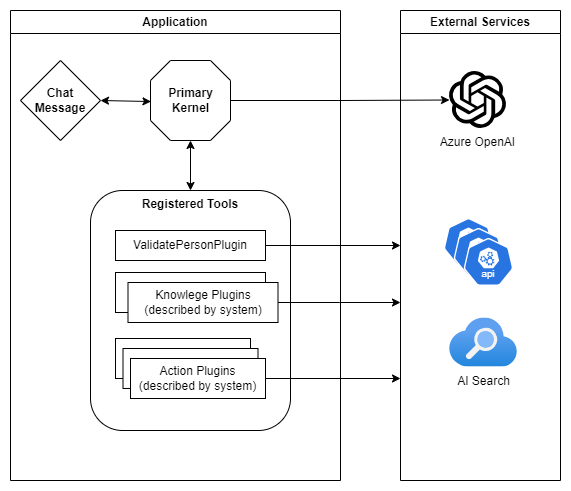
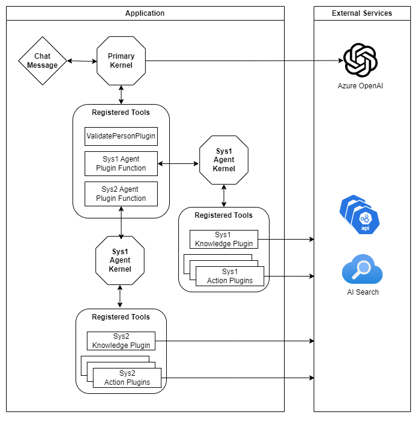
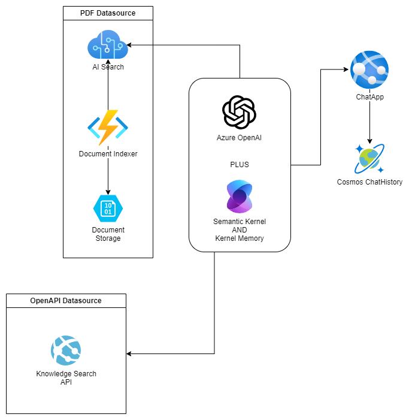
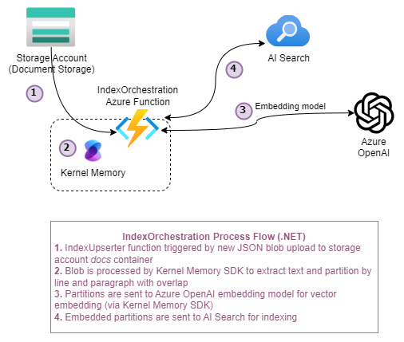
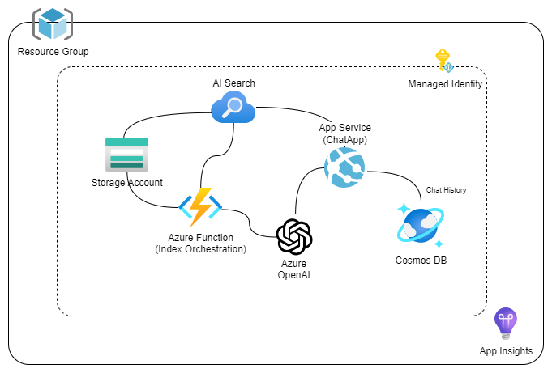

# Agentic Generative AI CoPilot Example

This is an example application that demonstrates the use of multiple "agents" with orchestration handled by Sematic Kernel and Azure OpenAI models to support user queries against multiple data sources as well as automated actions performed on behalf of the user where possible. 

## Features
- Front End Client:
	- Natural language chat UI and AI generative answers
	- Reference citations view support for retrieved supporting data
	- User feedback capture support on every AI-derived response
- Back End API:
	- blob triggered function to process, vector embed and index knowledge documents into AI Search
	- Semantic Kernel orchestration with automatic function calling (LLM-powered planning)
	- Optional agentic orchestration pattern (disabled by default in favor of a single orchestration kernal due preview status)
		- primary orchestration kernel for user interaction and dynamic selection of Agents via automatic function calling
		- individual Agent kernels, each with their own sets of tools (plugin functions) including knowledge sources, and API actions
		- automatic function calling (LLM-powered planning) within each kernel
	- RAG pattern support via vector search on indexed knowledge documents in AI Search data sources
	- Semantic and native plugin function patterns for agent actions
- Document Preparation:
	- Azure Blob trigger for easy processing
	- Default pipeline for standard text extraction, partitioning, embedding, and indexing in AI Search
	- High customizable and extensible framework for more custom processing pipelines

## Application Architecture

- **User Interface**:  The application's chat interface is a react/js web application. This interface is what accepts user messages and questions, routes request to the application backend, and displays generated responses.
	- originally based on the sample front end found in [Sample Chat App with AOAI - GitHub](https://github.com/microsoft/sample-app-aoai-chatGPT) 
- **Backend**: The application backend is an [ASP.NET Core Minimal API](https://learn.microsoft.com/aspnet/core/fundamentals/minimal-apis/overview). The backend, deployed to an Azure App Service, hosts the react web application and the Semantic Kernel and Kernel Memory orchestration of the different services. Services and SDKs used in the application include:
	- [Semantic Kernel](https://learn.microsoft.com/en-us/semantic-kernel/overview) - builds and orchestrates the agents, RAG pattern completion between the services, and API actions while managing chat history and other capabilities. Framework easily extended with additional plugin functions easy (more data sources, logic, actions, etc.).
	- [Kernel Memory (In Memory)](https://github.com/microsoft/kernel-memory) - SDK utilized to perform the [vector search](https://learn.microsoft.com/azure/search/ against AI Search vector-embedded data sources, while handling citation references for use by the front end.
	- [Azure OpenAI Service](https://learn.microsoft.com/azure/search/search-what-is-azure-search) - provides the Large Language Models to generate responses and for vectorization when needed.
- **Document Preparation**: an IndexOrchestration Azure Function is included for chunking, embedding and indexing knowledge documents. The Azure Function is triggered on new and overwritten blobs in a `docs` container of the deployed storage account. Services and SDKs used in this process include:
	- [Kernel Memory (In Memory)](https://github.com/microsoft/kernel-memory) - SDK utilitized to chunk/partition, vectorize and index knowledge documents into AI Search.
	- [Azure OpenAI Service](https://learn.microsoft.com/azure/ai-services/openai/overview) - provides the Large Language Models to generate vector embeddings for the indexed document partitions.
	- [Azure AI Search](https://learn.microsoft.com/azure/search/search-what-is-azure-search) - stores the vectorized knowledge partitions for vector search.

### Single Orchestration Kernel Flow



### Agentic Orchestration Flow



### RAG/Knowledge Flow



### Document Preparation Flow




# Getting Started

This sample application, as deployed, includes the following Azure components: 



## Account Requirements

In order to deploy and run this example, you'll need

- **Azure Account** - If you're new to Azure, get an [Azure account for free](https://aka.ms/free) and you'll get some free Azure credits to get started.
- **Azure subscription with access enabled for the Azure OpenAI service** - [You can request access](https://aka.ms/oaiapply). You can also visit [the Cognitive Search docs](https://azure.microsoft.com/free/cognitive-search/) to get some free Azure credits to get you started.
- **Azure account permissions** - Your Azure Account must have `Microsoft.Authorization/roleAssignments/write` permissions, such as [User Access Administrator](https://learn.microsoft.com/azure/role-based-access-control/built-in-roles#user-access-administrator) or [Owner](https://learn.microsoft.com/azure/role-based-access-control/built-in-roles#owner).

> [!WARNING]<br>
> By default this sample will create an Azure AI Search resource that has a monthly cost, as well as Document Intelligence (previously Form Recognizer) resource that has cost per document page. You can switch them to free versions of each of them if you want to avoid this cost by changing the parameters file under the infra folder (though there are some limits to consider)

## Cost estimation

Pricing varies per region and usage, so it isn't possible to predict exact costs for your usage. However, you can try the [Azure pricing calculator](https://azure.microsoft.com/pricing/calculator/) for the resources below:

- [**Azure App Service**](https://azure.microsoft.com/en-us/pricing/details/app-service/linux/)
- [**Azure Functions**](https://azure.microsoft.com/en-us/pricing/details/functions/)
- [**Azure OpenAI Service**](https://azure.microsoft.com/pricing/details/cognitive-services/openai-service/)
- [**Azure AI Search**](https://azure.microsoft.com/pricing/details/search/)
- [**Azure Blob Storage**](https://azure.microsoft.com/pricing/details/storage/blobs/)
- [**Azure Monitor**](https://azure.microsoft.com/pricing/details/monitor/)

## Deployment
This project supports `azd` for easy deployment of the complete application, as defined in the main.bicep resources.  

See [Deployment Instructions here](./infra/README.md).

### Process notes into the Search Service with Blob trigger

1. Add documents to be indexed, trigger the function:
	1. In Azure: navigate to the deployed storage account.
	1. Browse into the `Data storage/Containers` blade and into the `docs` container.
	1. Click `Upload` and add note JSON files to be processed.
1. Confirm successful indexing:
	1. In Azure: navigate to the deployed AI Search service
	1. Browse into the `Indexes` blade (Search Management) 
	1. A new `default` index should exist. 
	1. Open and search in the index to confirm content from the files uploaded are properly searchable.

> NOTE <br>
> It may take several minutes to see processed documents in the index

## Running locally for Dev and Debug
As many cloud resources are required to run the client app and minimal API even locally, deployment to Azure first will provision all the necessary services. You can then configure your local user secrets to point to those required cloud resources before building and running locally for the purposes of debugging and development.

**Required cloud resources:**
- Azure AI Search
- Azure OpenAI Service
	- chat model
	- embedding model
- Storage Account for blob trigger
- CosmosDB (optional)

### Running the ChatApp.Server and ChatApp.Client locally
1. Configure user secrets for the ChatApp.Server project, based on deployed resources.
	1. In Azure: navigate to the deployed Web App, and into the `Configuration` blade (under Settings).
	1. Copy the below required settings from the deployed Environment Variables into your local user secrets:
	```json
	{
		UNDER CONSTRUCTION
	}
	```
	> NOTE <br>
	> See `appsettings.json` in the ChatApp.Server project for more settings that can be configured in user secrets if using optional features such as CosmosDB for history.
1. Build and run the ChatApp.Server and ChatApp.Client projects
1. Open a browser and navigate to `https://localhost:5173` as instructed in the terminal to interact with the chat client.

### Running the IndexOrchestration function locally

1. Configure user secrets for the IndexOrchestration project, based on deployed resources.
	1. In Azure: navigate to the deployed Azure Function, and into the `Configuration` blade (under Settings).
	1. Copy the below required settings from the deployed Environment Variables into your local secrets:
	```json
	{
		UNDER CONSTRUCTION
	}
	```
	> NOTE <br>
	> See `local_settings_example.json` in the IndexOrchestration project for more settings that can optionally be configured.
1. Build and run the IndexOrchestration project
1. Upload or overwrite a knowledge file in the `docs` container of the storage account to trigger the function.

# There was an error exporting the HTTPS developer certificate to a file

If you see this error when trying to build or deploy the application, follow the guidance at this link [https://learn.microsoft.com/en-us/dotnet/core/compatibility/aspnet-core/9.0/certificate-export](https://learn.microsoft.com/en-us/dotnet/core/compatibility/aspnet-core/9.0/certificate-export).

1. Open your file explorer and create the 'https' directory under the following path: `C:\Users\<username>\AppData\Roaming\ASP.NET\`

# Considerations
UNDER CONSTRUCTION

# Contributing

This project welcomes contributions and suggestions.  Most contributions require you to agree to a
Contributor License Agreement (CLA) declaring that you have the right to, and actually do, grant us
the rights to use your contribution. For details, visit https://cla.opensource.microsoft.com.

When you submit a pull request, a CLA bot will automatically determine whether you need to provide
a CLA and decorate the PR appropriately (e.g., status check, comment). Simply follow the instructions
provided by the bot. You will only need to do this once across all repos using our CLA.

This project has adopted the [Microsoft Open Source Code of Conduct](https://opensource.microsoft.com/codeofconduct/).
For more information see the [Code of Conduct FAQ](https://opensource.microsoft.com/codeofconduct/faq/) or
contact [opencode@microsoft.com](mailto:opencode@microsoft.com) with any additional questions or comments.

## Trademarks

This project may contain trademarks or logos for projects, products, or services. Authorized use of Microsoft 
trademarks or logos is subject to and must follow 
[Microsoft's Trademark & Brand Guidelines](https://www.microsoft.com/en-us/legal/intellectualproperty/trademarks/usage/general).
Use of Microsoft trademarks or logos in modified versions of this project must not cause confusion or imply Microsoft sponsorship.
Any use of third-party trademarks or logos are subject to those third-party's policies.
